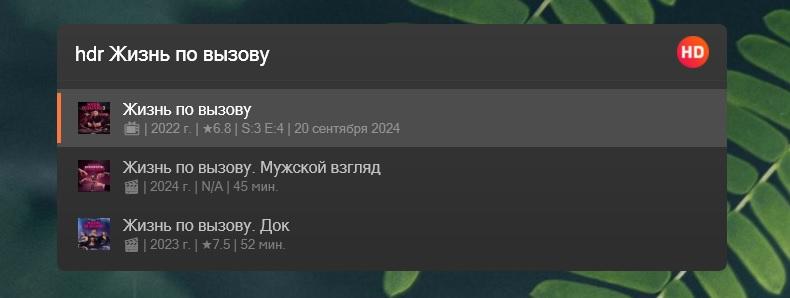

# HDRezka Plugin for Flow Launcher

## Overview
The **HDRezka Plugin for Flow Launcher** is designed to provide **quick and easy access** to movies and TV shows available on HDRezka.me. With just a few keystrokes, you can instantly find your favorite movies or TV series and access a variety of information at a glance.

This plugin delivers a **seamless experience** for HDRezka users, making it incredibly easy to browse and manage your watchlist while getting a sneak peek at essential statistics.

### Key Features:
- **Movies**: Get access to movie **posters**, **ratings**, and **release year**.
- **TV Shows**: View the **poster**, **release year**, **rating**, and **current status** of your favorite shows.
  - If the show is still ongoing, you can track the **current season and episode** as well as the **release date of the next episode**.
  - For completed shows or seasons, the plugin will notify you when a series or season has ended.
- **New episodes indicator**: When you search for a TV show again after new episodes have been released, the plugin will display a **star indicator** for up to **three new episodes**. This helps you easily spot if new content is available.

## How It Works:
To activate the plugin, simply use the keyword **`hdr`** followed by your query. For example, typing `hdr Breaking Bad` will instantly search and display relevant results for the TV show "Breaking Bad".

With **HDRezka Plugin for Flow Launcher**, you no longer need to visit the website manually. Everything you need is conveniently available directly from Flow Launcher, saving you time and improving your browsing experience.

Whether you're looking for your next movie night pick or tracking the latest episodes of your favorite series, this plugin has you covered.
